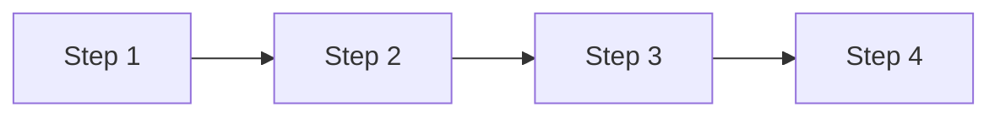

# AGENTS.md - Document Creation Guidelines

## 📋 Overview

This document provides instructions for AI agents to create comprehensive
educational documents following the established patterns and preferences from
the `class_1.md` template.

## 🎯 Document Structure

### 1. **Header Section**

Start every document with:

- A main title (e.g., `# BOOTCAMP 4.0`)
- A bullet-pointed list of topics to be developed (e.g., "- Tuesday: - Topic 1, - Topic 2...")
- Each topic should be linked to its corresponding section in the content
  example: (Don't use punctuation in links or numbered lists items)

```markdown
- day:
  - [A Test Section](#a-test-section)

## A Test Section
```

- A horizontal separator (`---`)

**Example:**

```markdown
# BOOTCAMP 4.0

- Tuesday:
  - Languages Overview: types, domain, implementation, supported paradigms.
  - Python: Introduction and installation.
  - Ways to run Python code.
  - Basic syntax and structure.

---
```

### 2. **Content Development Section**

After the separator, develop each topic listed in the header with:

- **Main sections** using `##` headings with emojis (e.g., `## 🎯 Main Topic`)
- **Subsections** using `###` headings with emojis (e.g., `### 💡 Subtopic`)
- **Detailed explanations** with paragraphs, lists, and code examples
- **Mermaid diagrams** to visualize concepts (see diagram guidelines below)
- **Code blocks** with proper syntax highlighting

### 3. **Footer Section**

Always end the document with the background image divs:

```html
<style>
  .background-images {
    pointer-events: none;
  }
  .background-images* {
    pointer-events: auto;
  }
</style>

<div
  class="background-images"
  style="
    position: fixed;
    top:0;
    display: flex;
    justify-content: center;
    align-items: center;
    height: 100vh;
    opacity: 0.1;
    z-index: 0;
  "
>
  
  
</div>
```

## 🎨 Mermaid Diagram Guidelines

### Supported Diagram Types (Mermaid 10.2.3)

✅ **Use these:**

- `graph TD` (Top-Down directed graph)
- `graph LR` (Left-Right directed graph)
- `sequenceDiagram` (Sequence diagrams)
- `timeline` (Timeline diagrams)
- `stateDiagram-v2` (State diagrams)

❌ **DO NOT use:**

- Character `~`
- `mindmap` (not supported)
- `flowchart` (use `graph` instead for maximum compatibility)
- Decision nodes `{}` (rhombus shapes)
- Link labels with `|text|` syntax, only works following this pattern:
  `A --> |arrow text| B[Node Text]`

### Diagram Wrapping

**ALWAYS** wrap Mermaid diagrams in a styled div:

````html
<div
  style="background-color: black; border-radius: 10px; padding: 20px; margin: 20px 0;"
>
  ```mermaid graph LR A[Node A] --> B[Node B]
</div>
````

</div>
```

### Diagram Orientation Rules

- **Use `graph LR`** (horizontal) when you have more than ~5 sibling nodes
  to prevent diagrams from becoming too wide
- **Use `graph TD`** (vertical) for linear processes or hierarchies with few sibling nodes
- Consider the A4-width display constraint: horizontal space is limited

### Color Palette (Dark tones for light text backgrounds)

Use these dark colors with white stroke and text:

- **Blue shades**: `#2C5F8D`, `#4169E1` (for general/process nodes)
- **Green shades**: `#228B22`, `#006400` (for success/positive nodes)
- **Brown/Gold shades**: `#8B4513`, `#DAA520`, `#B8860B` (for concepts/categories)
- **Purple shades**: `#8B008B`, `#4B0082` (for special/advanced topics)
- **Red shades**: `#8B0000`, `#DC143C` (for warnings/important nodes)

**Standard node styling:**

```mermaid
style A fill:#2C5F8D,stroke:#fff,stroke-width:3px,color:#fff
```

### Simplified Diagrams for Compatibility

For complex processes, prefer:

1. **Linear flows** over branching decision trees
2. **Multiple simple diagrams** over one complex diagram
3. **Markdown text + code blocks** for detailed steps instead of cramming everything into the diagram

**Example - Instead of complex flowchart:**



Then add detailed text below explaining conditional logic, system-specific instructions, etc.

## 🌟 Content Guidelines

### Language

- **ALL final document content MUST be in Spanish** (including headings,
  explanations, code comments where appropriate)
- Use clear, educational language suitable for bootcamp students
- Row must have 100 characters as maximum, then break lines appropriately.

### Use of Emojis

**Mandatory**: Use emojis to enhance readability and highlight key concepts:

- 🎯 Goals/Objectives
- 💡 Key concepts/Ideas
- 🐍 Python-specific content
- 🚀 Getting started/Installation
- ⚡ Performance/Speed
- 📊 Data/Statistics
- 🔧 Tools/Configuration
- ✅ Correct examples/Best practices
- ❌ Incorrect examples/Anti-patterns
- 📝 Notes/Important information
- 🌐 Web/Internet related
- 💻 Code/Programming
- 📚 Learning resources
- ⚠️ Warnings/Cautions

### Code Examples

- Use proper syntax highlighting (`python,`bash, etc.)
- Include comments in Spanish when helpful
- Show practical, runnable examples
- Demonstrate both correct (✅) and incorrect (❌) patterns when relevant
- Starting with the `Sintaxis y estructura básica` section, include multiple
  additional code blocks and, when applicable, terminal commands that reinforce
  each concept (e.g., script execution, linting tools, environment managers).
- Whenever you introduce a new structure (classes, functions, packages, environments),
  add a usage example plus the terminal command needed to run or verify it.
- All code snippets (including comments, string literals, identifiers, and outputs)
  must be written in English exclusively and should never include emojis; the surrounding
  explanatory text in the document must remain in Spanish.

### Section Organization

1. **Introduction**: Brief overview with emoji heading
2. **Core concepts**: Multiple subsections with explanations + diagrams
3. **Practical examples**: Code blocks and use cases
4. **Best practices**: Guidelines and recommendations (if applicable)
5. **References/Resources**: Links to documentation (if applicable)

## 🔍 Quality Checklist

Before considering the document complete, verify:

- [ ] Header section with topic list is present
- [ ] All topics from the header are developed in the content section
- [ ] All Mermaid diagrams are wrapped in black background divs
- [ ] All diagrams use compatible syntax (Mermaid 10.2.3)
- [ ] No `graph TD` diagrams have more than ~5 sibling nodes
- [ ] All diagram nodes use dark colors with white stroke/text
- [ ] Emojis are used throughout to highlight key points
- [ ] Content is entirely in Spanish
- [ ] Code examples have proper syntax highlighting
- [ ] Background image divs are at the end of the document
- [ ] Document is well-structured with clear hierarchy

## 📐 Additional Patterns

### Consistency in Styling

- Keep node styling consistent across all diagrams in the same document
- Use the same emoji for similar concept types throughout
- Maintain consistent heading levels (## for main topics, ### for subtopics)

### Educational Flow

- Start with high-level overview (graph diagrams)
- Progress to specific details (code examples, tables)
- End with practical applications (complete code samples)

### Visual Balance

- Alternate between text-heavy sections and visual elements (diagrams, code blocks)
- Don't overload any single section with too many diagrams
- Use whitespace effectively with margins on divs

### Accessibility

- Alt text on images (already in background div template)
- Descriptive node labels in diagrams
- Clear, semantic heading structure

## 🚀 Execution Steps for AI Agents

1. **Parse the topic list** from the header section
2. **Plan the document structure**: Identify main sections and subsections
3. **Research and develop content** for each topic in Spanish
4. **Create appropriate diagrams** following Mermaid 10.2.3 constraints
5. **Apply consistent styling**: dark colors, black backgrounds, emojis
6. **Add code examples** with proper syntax highlighting
7. **Review diagram orientation**: Adjust TD to LR if needed for wide diagrams
8. **Append background divs** at the end
9. **Final verification** against the quality checklist

## ⚠️ Common Pitfalls to Avoid

1. ❌ Using unsupported Mermaid syntax (mindmap, flowchart, decision nodes)
2. ❌ Light colors in diagram nodes (poor contrast with light text)
3. ❌ Wide `graph TD` diagrams with many siblings (won't fit A4 width)
4. ❌ Forgetting to wrap diagrams in black background divs
5. ❌ Missing emojis in headings and key points
6. ❌ Content in English (must be Spanish)
7. ❌ Forgetting the background image divs at the end

---

**Version:** 1.0  
**Last Updated:** 2025-11-13  
**Compatible with:** Mermaid 10.2.3, A4-width Markdown preprocessors
