# BOOTCAMP 4.0

- Jueves:
  - [Tipos de Datos](#tipos-de-datos): int, float, string, boolean.
  - [Colecciones Built-in](#colecciones-built-in): listas, tuplas, diccionarios, conjuntos.
  - [Estructuras de Control](#estructuras-de-control): if, for, while.
  - [Funciones Definidas por el Usuario y Módulos](#funciones-definidas-por-el-usuario-y-módulos).

---

## Tipos de Datos

### 🔢 Enteros (int)

```mermaid
graph LR
    A[int] --> B[Enteros positivos]
    A --> C[Enteros negativos]
    A --> D[Operaciones aritméticas]

    B --> B1[42, 1000, 999999]
    C --> C1[-10, -100]
    D --> D1[+, -, *, /, //, %, **]

    style A fill:#2C5F8D,stroke:#fff,stroke-width:3px,color:#fff
    style B fill:#4169E1,stroke:#fff,stroke-width:2px,color:#fff
    style C fill:#4169E1,stroke:#fff,stroke-width:2px,color:#fff
    style D fill:#4169E1,stroke:#fff,stroke-width:2px,color:#fff
```

<div style="background-color: black; border-radius: 10px; padding: 20px; margin: 20px 0;">



</div>

**Características de los enteros:**

Los enteros en Python son números sin parte decimal. Python 3 no tiene límite
práctico para el tamaño de enteros (limitado solo por la memoria disponible).

**Ejemplos de enteros:**

```python
# file: integers.py

# Positive integers
age = 25
count = 1000
large_number = 1_000_000  # Underscore for readability

# Negative integers
temperature = -10
debt = -5000

# Zero
zero = 0

# Arithmetic operations
a, b = 10, 3
print(f"Addition: {a + b}")           # 13
print(f"Subtraction: {a - b}")        # 7
print(f"Multiplication: {a * b}")    # 30
print(f"Division: {a / b}")          # 3.333... (returns float)
print(f"Floor division: {a // b}")   # 3 (integer division)
print(f"Modulus: {a % b}")           # 1 (remainder)
print(f"Exponentiation: {a ** b}")   # 1000

# Type checking
print(f"Type of 42: {type(42)}")     # <class 'int'>

# Conversion
string_number = "123"
integer_from_string = int(string_number)
print(f"Converted: {integer_from_string}, type: {type(integer_from_string)}")
```

```bash
python integers.py
```

### 📊 Números de Punto Flotante (float)

```mermaid
graph LR
    A[float] --> B[Decimales]
    A --> C[Notación científica]
    A --> D[Precisión limitada]

    B --> B1[3.14, 0.5, -2.7]
    C --> C1[1.5e3, 2e-4]
    D --> |aprox|D1[15-17 dígitos]

    style A fill:#228B22,stroke:#fff,stroke-width:3px,color:#fff
    style B fill:#006400,stroke:#fff,stroke-width:2px,color:#fff
    style C fill:#006400,stroke:#fff,stroke-width:2px,color:#fff
    style D fill:#006400,stroke:#fff,stroke-width:2px,color:#fff
```

<div style="background-color: black; border-radius: 10px; padding: 20px; margin: 20px 0;">



</div>

**Características de los flotantes:**

Los números de punto flotante representan números reales con parte decimal.
Python usa el estándar IEEE 754 de doble precisión.

**Ejemplos de flotantes:**

```python
# file: floats.py

# Decimal numbers
pi = 3.14159
price = 19.99
negative_float = -0.5

# Scientific notation
large_number = 1.5e3      # 1500.0
small_number = 2.5e-4     # 0.00025
very_large = 1e10         # 10000000000.0

# Operations with floats
a, b = 10.5, 3.2
print(f"Addition: {a + b}")           # 13.7
print(f"Subtraction: {a - b}")       # 7.3
print(f"Multiplication: {a * b}")    # 33.6
print(f"Division: {a / b}")          # 3.28125

# Type conversion
integer_to_float = float(42)          # 42.0
string_to_float = float("3.14")      # 3.14

# Precision considerations
result = 0.1 + 0.2
print(f"0.1 + 0.2 = {result}")       # 0.30000000000000004
print(f"Rounded: {round(result, 1)}")  # 0.3

# Special float values
infinity = float('inf')
negative_infinity = float('-inf')
not_a_number = float('nan')

print(f"Type of 3.14: {type(3.14)}")  # <class 'float'>
```

```bash
python floats.py
```

### 📝 Cadenas de Texto (string)

<div style="background-color: black; border-radius: 10px; padding: 20px; margin: 20px 0;">


</div>

**Características de las cadenas:**

Las cadenas de texto son secuencias inmutables de caracteres Unicode. Se pueden
crear con comillas simples, dobles o triples.

**Ejemplos de cadenas:**

```python
# file: strings.py

# String creation
single_quote = 'Hello World'
double_quote = "Hello World"
triple_quote = """Multi-line
string example"""

# String concatenation
first_name = "Alice"
last_name = "Smith"
full_name = first_name + " " + last_name
print(f"Full name: {full_name}")

# String repetition
repeated = "Ha" * 3
print(f"Repeated: {repeated}")  # HaHaHa

# String indexing
text = "Python"
print(f"First character: {text[0]}")      # P
print(f"Last character: {text[-1]}")      # n
print(f"Length: {len(text)}")             # 6

# String slicing
print(f"First 3 chars: {text[0:3]}")      # Pyt
print(f"From index 2: {text[2:]}")        # thon
print(f"Reverse: {text[::-1]}")           # nohtyP

# String methods
message = "  Hello World  "
print(f"Upper: {message.upper()}")        #   HELLO WORLD
print(f"Lower: {message.lower()}")        #   hello world
print(f"Strip: '{message.strip()}'")      # Hello World
print(f"Replace: {message.replace('World', 'Python')}")

# String formatting (f-strings)
name = "Alice"
age = 30
formatted = f"My name is {name} and I'm {age} years old"
print(formatted)

# String methods - checking
email = "user@example.com"
print(f"Is digit: {'123'.isdigit()}")     # True
print(f"Is alpha: {'abc'.isalpha()}")    # True
print(f"Starts with: {email.startswith('user')}")  # True
print(f"Ends with: {email.endswith('.com')}")      # True

# Type conversion
number = 42
string_from_int = str(number)
print(f"Type: {type(string_from_int)}")  # <class 'str'>
```

```bash
python strings.py
```

### ✅ Booleanos (bool)

<div style="background-color: black; border-radius: 10px; padding: 20px; margin: 20px 0;">


</div>

**Características de los booleanos:**

Los valores booleanos representan verdadero o falso. En Python, muchos valores se
evalúan como verdadero o falso en contextos booleanos (truthiness).

**Ejemplos de booleanos:**

```python
# file: booleans.py

# Boolean values
is_active = True
is_complete = False

# Boolean operations
p, q = True, False
print(f"AND: {p and q}")         # False
print(f"OR: {p or q}")           # True
print(f"NOT p: {not p}")         # False
print(f"NOT q: {not q}")        # True

# Truthiness - values that evaluate to False
falsy_values = [False, None, 0, 0.0, "", [], (), {}]
for value in falsy_values:
    print(f"{value!r} is {bool(value)}")

# Truthiness - values that evaluate to True
truthy_values = [True, 1, -1, 0.1, "hello", [1], (1,), {"key": "value"}]
for value in truthy_values:
    print(f"{value!r} is {bool(value)}")

# Comparison operators return booleans
x, y = 5, 10
print(f"5 == 10: {x == y}")      # False
print(f"5 != 10: {x != y}")     # True
print(f"5 < 10: {x < y}")       # True
print(f"5 > 10: {x > y}")       # False
print(f"5 <= 10: {x <= y}")     # True
print(f"5 >= 10: {x >= y}")     # False

# Boolean conversion
print(f"bool(0): {bool(0)}")           # False
print(f"bool(1): {bool(1)}")           # True
print(f"bool(''): {bool('')}")         # False
print(f"bool('hello'): {bool('hello')}")  # True
print(f"bool([]): {bool([])}")         # False
print(f"bool([1, 2]): {bool([1, 2])}")  # True

# Type checking
print(f"Type of True: {type(True)}")   # <class 'bool'>
print(f"isinstance(True, bool): {isinstance(True, bool)}")  # True
```

```bash
python booleans.py
```

---

## Colecciones Built-in

### 📋 Listas (list)

```mermaid
graph LR
    A[list] --> B[Mutables]
    A --> C[Ordenadas]
    A --> D[Indexación]

    B --> B1[Se pueden modificar]
    C --> C1[Mantienen orden]
    D --> D1[Acceso por índice]

    style A fill:#2C5F8D,stroke:#fff,stroke-width:3px,color:#fff
    style B fill:#4169E1,stroke:#fff,stroke-width:2px,color:#fff
    style C fill:#4169E1,stroke:#fff,stroke-width:2px,color:#fff
    style D fill:#4169E1,stroke:#fff,stroke-width:2px,color:#fff
```

<div style="background-color: black; border-radius: 10px; padding: 20px; margin: 20px 0;">



</div>

**Características de las listas:**

Las listas son colecciones ordenadas y mutables de elementos. Pueden contener
elementos de diferentes tipos y se pueden modificar después de su creación.

**Ejemplos de listas:**

```python
# file: lists.py

# List creation
numbers = [1, 2, 3, 4, 5]
fruits = ["apple", "banana", "orange"]
mixed = [1, "two", 3.0, True]
empty_list = []

# Accessing elements
print(f"First element: {fruits[0]}")      # apple
print(f"Last element: {fruits[-1]}")      # orange
print(f"Slice: {numbers[1:3]}")          # [2, 3]

# Modifying lists
fruits.append("grape")                    # Add to end
print(f"After append: {fruits}")

fruits.insert(1, "mango")                 # Insert at index
print(f"After insert: {fruits}")

fruits.remove("banana")                   # Remove by value
print(f"After remove: {fruits}")

popped = fruits.pop()                      # Remove and return last
print(f"Popped: {popped}, List: {fruits}")

# List operations
list1 = [1, 2, 3]
list2 = [4, 5, 6]
combined = list1 + list2                   # Concatenation
print(f"Combined: {combined}")

repeated = [1, 2] * 3                     # Repetition
print(f"Repeated: {repeated}")            # [1, 2, 1, 2, 1, 2]

# List methods
numbers = [3, 1, 4, 1, 5, 9, 2, 6]
numbers.sort()                            # Sort in place
print(f"Sorted: {numbers}")

numbers.reverse()                         # Reverse in place
print(f"Reversed: {numbers}")

count = numbers.count(1)                   # Count occurrences
print(f"Count of 1: {count}")

index = numbers.index(4)                   # Find index
print(f"Index of 4: {index}")

# List comprehension
squares = [x**2 for x in range(5)]
print(f"Squares: {squares}")              # [0, 1, 4, 9, 16]

even_squares = [x**2 for x in range(10) if x % 2 == 0]
print(f"Even squares: {even_squares}")     # [0, 4, 16, 36, 64]

# Nested lists
matrix = [[1, 2, 3], [4, 5, 6], [7, 8, 9]]
print(f"Matrix[1][2]: {matrix[1][2]}")    # 6
```

```bash
python lists.py
```

### 🔒 Tuplas (tuple)

```mermaid
graph LR
    A[tuple] --> B[Inmutables]
    A --> C[Ordenadas]
    A --> D[Indexación]

    B --> B1[No se pueden modificar]
    C --> C1[Mantienen orden]
    D --> D1[Acceso por índice]

    style A fill:#228B22,stroke:#fff,stroke-width:3px,color:#fff
    style B fill:#006400,stroke:#fff,stroke-width:2px,color:#fff
    style C fill:#006400,stroke:#fff,stroke-width:2px,color:#fff
    style D fill:#006400,stroke:#fff,stroke-width:2px,color:#fff
```

<div style="background-color: black; border-radius: 10px; padding: 20px; margin: 20px 0;">



</div>

**Características de las tuplas:**

Las tuplas son colecciones ordenadas e inmutables de elementos. Una vez creadas,
no se pueden modificar. Son útiles para datos que no deben cambiar.

**Ejemplos de tuplas:**

```python
# file: tuples.py

# Tuple creation
coordinates = (10, 20)
point = 3, 4                              # Parentheses optional
single_tuple = (42,)                      # Comma required for single element
empty_tuple = ()

# Accessing elements
print(f"First coordinate: {coordinates[0]}")  # 10
print(f"Second coordinate: {coordinates[1]}") # 20
print(f"Slice: {coordinates[0:1]}")          # (10,)

# Tuple unpacking
x, y = coordinates
print(f"x: {x}, y: {y}")

# Multiple assignment
a, b, c = 1, 2, 3
print(f"a: {a}, b: {b}, c: {c}")

# Tuple operations
tuple1 = (1, 2, 3)
tuple2 = (4, 5, 6)
combined = tuple1 + tuple2                # Concatenation
print(f"Combined: {combined}")

repeated = (1, 2) * 3                    # Repetition
print(f"Repeated: {repeated}")

# Tuple methods
numbers = (3, 1, 4, 1, 5, 9, 2, 6)
count = numbers.count(1)                  # Count occurrences
print(f"Count of 1: {count}")

index = numbers.index(4)                  # Find index
print(f"Index of 4: {index}")

# Tuples as return values
def get_name_age():
    return "Alice", 30

name, age = get_name_age()
print(f"Name: {name}, Age: {age}")

# Tuples vs lists
list_example = [1, 2, 3]
tuple_example = (1, 2, 3)

# list_example[0] = 10  # OK - lists are mutable
# tuple_example[0] = 10  # Error - tuples are immutable

# Use cases for tuples
# 1. Coordinates
point_3d = (1, 2, 3)

# 2. RGB colors
red = (255, 0, 0)
green = (0, 255, 0)
blue = (0, 0, 255)

# 3. Dictionary keys (must be hashable)
locations = {
    (0, 0): "Origin",
    (1, 1): "Corner"
}
print(f"Location at (0,0): {locations[(0, 0)]}")
```

```bash
python tuples.py
```

### 🗺️ Diccionarios (dict)

<div style="background-color: black; border-radius: 10px; padding: 20px; margin: 20px 0;">


</div>

**Características de los diccionarios:**

Los diccionarios son colecciones de pares clave-valor. Las claves deben ser inmutables
(hashable) y únicas. A partir de Python 3.7, mantienen el orden de inserción.

**Ejemplos de diccionarios:**

```python
# file: dictionaries.py

# Dictionary creation
person = {
    "name": "Alice",
    "age": 30,
    "city": "Madrid"
}

empty_dict = {}
another_dict = dict()

# Accessing values
print(f"Name: {person['name']}")         # Alice
print(f"Age: {person.get('age')}")       # 30
print(f"Safe access: {person.get('email', 'N/A')}")  # N/A (default)

# Modifying dictionaries
person["email"] = "alice@example.com"    # Add/update
person.update({"country": "Spain", "age": 31})  # Update multiple
print(f"Updated person: {person}")

# Removing items
del person["city"]                        # Delete key
removed = person.pop("age")               # Remove and return value
print(f"Removed age: {removed}")

# Dictionary methods
keys = person.keys()                     # View of keys
values = person.values()                 # View of values
items = person.items()                   # View of key-value pairs

print(f"Keys: {list(keys)}")
print(f"Values: {list(values)}")
print(f"Items: {list(items)}")

# Iterating dictionaries
for key in person:
    print(f"{key}: {person[key]}")

for key, value in person.items():
    print(f"{key}: {value}")

# Dictionary comprehension
squares_dict = {x: x**2 for x in range(5)}
print(f"Squares dict: {squares_dict}")

# Filtered dictionary comprehension
even_squares = {x: x**2 for x in range(10) if x % 2 == 0}
print(f"Even squares: {even_squares}")

# Nested dictionaries
students = {
    "alice": {"age": 20, "grade": "A"},
    "bob": {"age": 21, "grade": "B"},
    "charlie": {"age": 19, "grade": "A"}
}

print(f"Alice's grade: {students['alice']['grade']}")

# Dictionary operations
dict1 = {"a": 1, "b": 2}
dict2 = {"c": 3, "d": 4}
merged = {**dict1, **dict2}              # Merge dictionaries
print(f"Merged: {merged}")

# Checking membership
print(f"'name' in person: {'name' in person}")  # True
print(f"'phone' in person: {'phone' in person}")  # False
```

```bash
python dictionaries.py
```

### 🔷 Conjuntos (set)

<div style="background-color: black; border-radius: 10px; padding: 20px; margin: 20px 0;">


</div>

**Características de los conjuntos:**

Los conjuntos son colecciones no ordenadas de elementos únicos. Son útiles para
operaciones matemáticas de conjuntos y eliminar duplicados.

**Ejemplos de conjuntos:**

```python
# file: sets.py

# Set creation
fruits = {"apple", "banana", "orange"}
numbers_set = set([1, 2, 3, 3, 4])      # Duplicates removed
empty_set = set()                       # Note: {} creates dict, not set

# Adding and removing
fruits.add("grape")                     # Add single element
fruits.update(["mango", "kiwi"])       # Add multiple
print(f"After adding: {fruits}")

fruits.remove("banana")                 # Remove (raises error if not found)
fruits.discard("mango")                 # Remove (no error if not found)
print(f"After removing: {fruits}")

# Set operations
set1 = {1, 2, 3, 4, 5}
set2 = {4, 5, 6, 7, 8}

union = set1 | set2                     # Union
print(f"Union: {union}")                # {1, 2, 3, 4, 5, 6, 7, 8}

intersection = set1 & set2              # Intersection
print(f"Intersection: {intersection}")  # {4, 5}

difference = set1 - set2                # Difference
print(f"Difference: {difference}")      # {1, 2, 3}

symmetric_diff = set1 ^ set2            # Symmetric difference
print(f"Symmetric diff: {symmetric_diff}")  # {1, 2, 3, 6, 7, 8}

# Set methods
set1.union(set2)                       # Same as |
set1.intersection(set2)                 # Same as &
set1.difference(set2)                   # Same as -
set1.symmetric_difference(set2)         # Same as ^

# Set comparisons
set_a = {1, 2, 3}
set_b = {1, 2, 3, 4, 5}
set_c = {1, 2, 3}

print(f"set_a is subset of set_b: {set_a.issubset(set_b)}")  # True
print(f"set_b is superset of set_a: {set_b.issuperset(set_a)}")  # True
print(f"set_a == set_c: {set_a == set_c}")  # True

# Set comprehension
squares_set = {x**2 for x in range(5)}
print(f"Squares set: {squares_set}")   # {0, 1, 4, 9, 16}

# Removing duplicates from list
numbers_list = [1, 2, 2, 3, 3, 3, 4, 5]
unique_numbers = list(set(numbers_list))
print(f"Unique: {unique_numbers}")      # [1, 2, 3, 4, 5]

# Checking membership
print(f"'apple' in fruits: {'apple' in fruits}")  # True
print(f"'banana' in fruits: {'banana' in fruits}")  # False
```

```bash
python sets.py
```

---

## Estructuras de Control

### 💡 Condicional if

<div style="background-color: black; border-radius: 10px; padding: 20px; margin: 20px 0;">


</div>

**Características de if:**

La estructura condicional `if` permite ejecutar código basado en condiciones.
Se puede combinar con `elif` (else if) y `else` para múltiples casos.

**Ejemplos de condicionales:**

```python
# file: conditionals.py

# Basic if statement
age = 18
if age >= 18:
    print("You are an adult")

# if-else
temperature = 25
if temperature > 20:
    print("It's warm")
else:
    print("It's cold")

# if-elif-else chain
score = 85
if score >= 90:
    grade = "A"
elif score >= 80:
    grade = "B"
elif score >= 70:
    grade = "C"
elif score >= 60:
    grade = "D"
else:
    grade = "F"
print(f"Grade: {grade}")

# Nested conditionals
x, y = 10, 5
if x > 0:
    if y > 0:
        print("Both are positive")
    else:
        print("x is positive, y is not")
else:
    print("x is not positive")

# Multiple conditions
age = 25
has_license = True
if age >= 18 and has_license:
    print("Can drive")

# Ternary operator (conditional expression)
status = "active" if age >= 18 else "inactive"
print(f"Status: {status}")

# Truthiness in conditionals
name = ""
if name:
    print(f"Hello, {name}")
else:
    print("No name provided")

# Checking membership
fruits = ["apple", "banana", "orange"]
if "apple" in fruits:
    print("Apple is in the list")

# Multiple elif conditions
day = "Monday"
if day == "Monday":
    print("Start of work week")
elif day == "Friday":
    print("End of work week")
elif day in ["Saturday", "Sunday"]:
    print("Weekend!")
else:
    print("Midweek")
```

```bash
python conditionals.py
```

### 🔄 Bucle for

```mermaid
graph TD
    A[for elemento in iterable] --> B[Iterar sobre elementos]
    B --> C[Ejecutar bloque]
    C --> D{Más elementos?}
    D -->|Sí| B
    D -->|No| E[Continuar después del bucle]

    style A fill:#228B22,stroke:#fff,stroke-width:3px,color:#fff
    style B fill:#006400,stroke:#fff,stroke-width:2px,color:#fff
    style C fill:#006400,stroke:#fff,stroke-width:2px,color:#fff
    style D fill:#4169E1,stroke:#fff,stroke-width:2px,color:#fff
    style E fill:#228B22,stroke:#fff,stroke-width:2px,color:#fff
```

<div style="background-color: black; border-radius: 10px; padding: 20px; margin: 20px 0;">



</div>

**Características de for:**

El bucle `for` itera sobre elementos de una secuencia o cualquier objeto iterable.
Es la forma más común de recorrer colecciones en Python.

**Ejemplos de bucles for:**

```python
# file: for_loops.py

# Iterating over a list
fruits = ["apple", "banana", "orange"]
for fruit in fruits:
    print(f"Fruit: {fruit}")

# Iterating over a range
for i in range(5):
    print(f"Number: {i}")

# Range with start and end
for i in range(2, 8):
    print(f"Number: {i}")

# Range with step
for i in range(0, 10, 2):
    print(f"Even: {i}")

# Iterating with enumerate (index and value)
fruits = ["apple", "banana", "orange"]
for index, fruit in enumerate(fruits):
    print(f"{index}: {fruit}")

# Iterating over a string
text = "Python"
for char in text:
    print(char)

# Iterating over a dictionary
person = {"name": "Alice", "age": 30, "city": "Madrid"}
for key in person:
    print(f"{key}: {person[key]}")

for key, value in person.items():
    print(f"{key}: {value}")

# Nested loops
for i in range(3):
    for j in range(2):
        print(f"i={i}, j={j}")

# Loop with else clause (executes if no break)
for i in range(5):
    if i == 10:
        break
else:
    print("Loop completed without break")

# List comprehension (alternative to for loop)
squares = [x**2 for x in range(5)]
print(f"Squares: {squares}")

# Dictionary comprehension
squares_dict = {x: x**2 for x in range(5)}
print(f"Squares dict: {squares_dict}")

# Set comprehension
unique_squares = {x**2 for x in range(-3, 4)}
print(f"Unique squares: {unique_squares}")

# Filtered comprehension
even_squares = [x**2 for x in range(10) if x % 2 == 0]
print(f"Even squares: {even_squares}")
```

```bash
python for_loops.py
```

### 🔁 Bucle while

<div style="background-color: black; border-radius: 10px; padding: 20px; margin: 20px 0;">


</div>

**Características de while:**

El bucle `while` ejecuta un bloque de código mientras una condición sea verdadera.
Es útil cuando no se conoce el número exacto de iteraciones.

**Ejemplos de bucles while:**

```python
# file: while_loops.py

# Basic while loop
count = 0
while count < 5:
    print(f"Count: {count}")
    count += 1

# While with user input simulation
# In real scenario, this would wait for user input
attempts = 0
max_attempts = 3
password = "secret"

# Simulating password check
entered_password = "wrong"
while entered_password != password and attempts < max_attempts:
    attempts += 1
    print(f"Attempt {attempts}: Access denied")
    # In real code: entered_password = input("Enter password: ")

# While with break
count = 0
while True:
    print(f"Count: {count}")
    count += 1
    if count >= 5:
        break

# While with continue
count = 0
while count < 10:
    count += 1
    if count % 2 == 0:
        continue  # Skip even numbers
    print(f"Odd: {count}")

# While with else clause
count = 0
while count < 5:
    print(f"Count: {count}")
    count += 1
else:
    print("Loop completed normally")

# Counter-controlled loop
i = 0
numbers = []
while i < 5:
    numbers.append(i * 2)
    i += 1
print(f"Numbers: {numbers}")

# Condition-controlled loop
data = [1, 2, 3, 4, 5]
while data:
    item = data.pop()
    print(f"Popped: {item}")

# Nested while loops
i = 1
while i <= 3:
    j = 1
    while j <= 2:
        print(f"i={i}, j={j}")
        j += 1
    i += 1

# Infinite loop with break (common pattern)
while True:
    user_input = "quit"  # Simulating user input
    if user_input == "quit":
        break
    print("Processing...")
```

```bash
python while_loops.py
```

---

## Funciones Definidas por el Usuario y Módulos

### 🎯 Funciones Definidas por el Usuario

```mermaid
graph LR
    A[def función] --> B[Parámetros]
    A --> C[Cuerpo]
    A --> D[return]

    B --> B1[Opcionales con valores por defecto]
    C --> C1[Lógica de la función]
    D --> D1[Valor de retorno opcional]

    style A fill:#2C5F8D,stroke:#fff,stroke-width:3px,color:#fff
    style B fill:#4169E1,stroke:#fff,stroke-width:2px,color:#fff
    style C fill:#4169E1,stroke:#fff,stroke-width:2px,color:#fff
    style D fill:#4169E1,stroke:#fff,stroke-width:2px,color:#fff
```

<div style="background-color: black; border-radius: 10px; padding: 20px; margin: 20px 0;">



</div>

**Características de las funciones:**

Las funciones permiten organizar código en bloques reutilizables. Se definen
con `def` y pueden tener parámetros y valores de retorno.

**Ejemplos de funciones:**

```python
# file: functions.py

# Basic function
def greet():
    print("Hello, World!")

greet()

# Function with parameters
def greet_person(name):
    print(f"Hello, {name}!")

greet_person("Alice")

# Function with return value
def add(a, b):
    return a + b

result = add(5, 3)
print(f"Sum: {result}")

# Function with default parameters
def greet_with_title(name, title="Mr"):
    print(f"Hello, {title} {name}")

greet_with_title("Smith")
greet_with_title("Alice", "Ms")

# Function with multiple return values
def get_name_age():
    return "Alice", 30

name, age = get_name_age()
print(f"Name: {name}, Age: {age}")

# Function with variable arguments (*args)
def sum_all(*numbers):
    total = 0
    for num in numbers:
        total += num
    return total

print(f"Sum: {sum_all(1, 2, 3, 4, 5)}")

# Function with keyword arguments (**kwargs)
def create_person(**info):
    person = {}
    for key, value in info.items():
        person[key] = value
    return person

person = create_person(name="Alice", age=30, city="Madrid")
print(f"Person: {person}")

# Function with type hints
def multiply(a: int, b: int) -> int:
    return a * b

result = multiply(4, 5)
print(f"Product: {result}")

# Lambda functions (anonymous functions)
square = lambda x: x ** 2
print(f"Square of 5: {square(5)}")

# Lambda with map
numbers = [1, 2, 3, 4, 5]
squared = list(map(lambda x: x**2, numbers))
print(f"Squared: {squared}")

# Lambda with filter
even_numbers = list(filter(lambda x: x % 2 == 0, numbers))
print(f"Even: {even_numbers}")

# Nested functions
def outer_function(x):
    def inner_function(y):
        return y * 2
    return inner_function(x)

result = outer_function(5)
print(f"Result: {result}")

# Function as argument
def apply_operation(x, y, operation):
    return operation(x, y)

def add_op(a, b):
    return a + b

def multiply_op(a, b):
    return a * b

print(f"Add: {apply_operation(5, 3, add_op)}")
print(f"Multiply: {apply_operation(5, 3, multiply_op)}")
```

```bash
python functions.py
```

### 📦 Módulos

```mermaid
graph LR
    A[Módulos] --> B[import]
    A --> C[from import]
    A --> D[Crear módulos]

    B --> B1[Importar módulo completo]
    C --> C1[Importar elementos específicos]
    D --> D1[Archivos .py]

    style A fill:#8B4513,stroke:#fff,stroke-width:3px,color:#fff
    style B fill:#DAA520,stroke:#fff,stroke-width:2px,color:#fff
    style C fill:#DAA520,stroke:#fff,stroke-width:2px,color:#fff
    style D fill:#DAA520,stroke:#fff,stroke-width:2px,color:#fff
```

<div style="background-color: black; border-radius: 10px; padding: 20px; margin: 20px 0;">



</div>

**Características de los módulos:**

Los módulos son archivos Python que contienen definiciones y declaraciones.
Permiten organizar código en múltiples archivos y reutilizar código.

**Ejemplos de módulos:**

```python
# file: math_utils.py
# This would be a separate module file

def add(a, b):
    return a + b

def subtract(a, b):
    return a - b

def multiply(a, b):
    return a * b

def divide(a, b):
    if b == 0:
        raise ValueError("Cannot divide by zero")
    return a / b

PI = 3.14159
E = 2.71828
```

```python
# file: using_modules.py
# Using the math_utils module

# Import entire module
import math_utils

result = math_utils.add(5, 3)
print(f"Sum: {result}")

print(f"PI: {math_utils.PI}")

# Import specific functions
from math_utils import add, multiply

result = add(10, 5)
print(f"Sum: {result}")

result = multiply(4, 7)
print(f"Product: {result}")

# Import with alias
import math_utils as mu

result = mu.subtract(10, 3)
print(f"Difference: {result}")

# Import all (not recommended)
from math_utils import *

result = divide(10, 2)
print(f"Quotient: {result}")

# Import standard library modules
import math
import random
import datetime

print(f"Square root of 16: {math.sqrt(16)}")
print(f"Random number: {random.randint(1, 10)}")
print(f"Current time: {datetime.datetime.now()}")

# Import with specific items from standard library
from math import pi, sqrt
from random import choice

print(f"Pi: {pi}")
print(f"Square root: {sqrt(25)}")
fruits = ["apple", "banana", "orange"]
print(f"Random fruit: {choice(fruits)}")
```

```bash
# First create the math_utils.py module
# Then run:
python using_modules.py
```

### 📚 Estructura de Módulos y Paquetes

```mermaid
graph TD
    A[Paquete] --> B[__init__.py]
    A --> C[Módulos]
    C --> D[funciones.py]
    C --> E[clases.py]
    C --> F[utilidades.py]

    style A fill:#8B008B,stroke:#fff,stroke-width:3px,color:#fff
    style B fill:#4B0082,stroke:#fff,stroke-width:2px,color:#fff
    style C fill:#4B0082,stroke:#fff,stroke-width:2px,color:#fff
```

<div style="background-color: black; border-radius: 10px; padding: 20px; margin: 20px 0;">



</div>

**Estructura de paquetes:**

Los paquetes son directorios que contienen múltiples módulos. Se identifican por
la presencia de un archivo `__init__.py`.

**Ejemplo de estructura de paquete:**

```python
# file: mypackage/__init__.py
# Package initialization file

from .functions import greet, calculate
from .classes import Person

__all__ = ['greet', 'calculate', 'Person']
```

```python
# file: mypackage/functions.py
# Functions module

def greet(name):
    return f"Hello, {name}!"

def calculate(a, b, operation):
    if operation == "add":
        return a + b
    elif operation == "multiply":
        return a * b
    return None
```

```python
# file: mypackage/classes.py
# Classes module

class Person:
    def __init__(self, name, age):
        self.name = name
        self.age = age

    def introduce(self):
        return f"I'm {self.name}, {self.age} years old"
```

```python
# file: using_package.py
# Using the package

from mypackage import greet, calculate, Person

# Using functions
message = greet("Alice")
print(message)

result = calculate(5, 3, "add")
print(f"Result: {result}")

# Using classes
person = Person("Bob", 25)
print(person.introduce())
```

```bash
# Create the package structure first, then:
python using_package.py
```

### 🔍 Búsqueda de Módulos y sys.path

```mermaid
graph LR
    A[Python busca módulos] --> B[Directorio actual]
    A --> C[PYTHONPATH]
    A --> D[Directorio estándar]

    B --> B1[Donde se ejecuta el script]
    C --> C1[Variables de entorno]
    D --> D1[site-packages]

    style A fill:#8B0000,stroke:#fff,stroke-width:3px,color:#fff
    style B fill:#DC143C,stroke:#fff,stroke-width:2px,color:#fff
    style C fill:#DC143C,stroke:#fff,stroke-width:2px,color:#fff
    style D fill:#DC143C,stroke:#fff,stroke-width:2px,color:#fff
```

<div style="background-color: black; border-radius: 10px; padding: 20px; margin: 20px 0;">



</div>

**Cómo Python encuentra módulos:**

Python busca módulos en varios lugares siguiendo un orden específico definido en `sys.path`.

**Ejemplo de búsqueda de módulos:**

```python
# file: module_search.py

import sys
import os

# View Python path
print("Python search paths:")
for path in sys.path:
    print(f"  - {path}")

# Add custom path
custom_path = "/path/to/custom/modules"
if custom_path not in sys.path:
    sys.path.append(custom_path)

# Check if module exists
import importlib.util

def module_exists(module_name):
    spec = importlib.util.find_spec(module_name)
    return spec is not None

print(f"\nmath module exists: {module_exists('math')}")
print(f"custom_module exists: {module_exists('custom_module')}")

# Get module location
import math
print(f"\nmath module location: {math.__file__}")
```

```bash
python module_search.py
```

---

<style>
  .background-images {
    pointer-events: none;
  }
  .background-images* {
    pointer-events: auto;
  }
</style>

<div
  class="background-images"
  style="
    position: fixed;
    top:0;
    display: flex;
    justify-content: center;
    align-items: center;
    height: 100vh;
    opacity: 0.1;
    z-index: 0;
  "
>


</div>
