# BOOTCAMP 4.0

- Martes:
  - [Programación Orientada a Objetos](#programación-orientada-a-objetos):
    - definición
    - métodos principales (`__init__`, `__str__`, `__repr__`)
    - sobrecarga de operadores (`__add__`, `__sub__`, `__eq__`, etc.).
  - [Analogía con Paquetes y Módulos de Python](#analogía-con-paquetes-y-módulos-de-python):
    - `__init__.py`, `__all__`, `docstrings`.
  - [Gestión de Entornos](#gestión-de-entornos): paquetes y entornos virtuales.
  - [Librerías para Análisis de Datos](#librerías-para-análisis-de-datos):
    pandas, numpy, matplotlib.
  - [Lectura y Escritura de Archivos](#lectura-y-escritura-de-archivos): CSV, Excel.

---

## Programación Orientada a Objetos

### 🎯 ¿Qué es la Programación Orientada a Objetos?

La Programación Orientada a Objetos (OOP) es un paradigma de programación que
organiza el código en estructuras llamadas **clases** que encapsulan datos
(atributos) y comportamientos (métodos). Los objetos son instancias de estas
clases.

<div style="background-color: black; border-radius: 10px; padding: 20px; margin: 20px 0;">


</div>

**Pilares fundamentales de la OOP:**

1. **Encapsulación**: Agrupar datos y métodos relacionados en una clase
2. **Abstracción**: Ocultar detalles de implementación complejos
3. **Herencia**: Crear nuevas clases basadas en clases existentes
4. **Polimorfismo**: Usar la misma interfaz para diferentes tipos de objetos

**Ejemplo básico de clase:**

```python
# file: basic_class.py

class Person:
    """Simple Person class example."""

    def __init__(self, name, age):
        self.name = name
        self.age = age

    def introduce(self):
        return (f"Hi, I'm {self.name} and "
                f"I'm {self.age} years old")

# Create instances (objects)
person1 = Person("Alice", 30)
person2 = Person("Bob", 25)

print(person1.introduce())
print(person2.introduce())
```

```bash
python basic_class.py
```

### 💡 Métodos Especiales (Magic Methods)

Los métodos especiales en Python son métodos que tienen nombres que comienzan y
terminan con doble guion bajo (`__`). Permiten definir cómo se comportan los
objetos con operadores y funciones built-in.

```mermaid
graph LR
    A[Métodos Especiales] --> B[__init__]
    A --> C[__str__]
    A --> D[__repr__]
    A --> E[__add__]
    A --> F[__eq__]

    B --> B1[Constructor]
    C --> C1[Representación legible]
    D --> D1[Representación técnica]
    E --> E1[Sobrecarga +]
    F --> F1[Sobrecarga ==]

    style A fill:#8B008B,stroke:#fff,stroke-width:3px,color:#fff
    style B fill:#4B0082,stroke:#fff,stroke-width:2px,color:#fff
    style C fill:#4B0082,stroke:#fff,stroke-width:2px,color:#fff
    style D fill:#4B0082,stroke:#fff,stroke-width:2px,color:#fff
    style E fill:#4B0082,stroke:#fff,stroke-width:2px,color:#fff
    style F fill:#4B0082,stroke:#fff,stroke-width:2px,color:#fff
```

<div style="background-color: black; border-radius: 10px; padding: 20px; margin: 20px 0;">



</div>

#### 🔧 `__init__`: Constructor

El método `__init__` se llama automáticamente cuando se crea una instancia de la
clase. Se usa para inicializar los atributos del objeto.

**Ejemplo de `__init__`:**

```python
# file: init_method.py

class Rectangle:
    """Rectangle class with __init__ method."""

    def __init__(self, width, height):
        self.width = width
        self.height = height
        self.area = width * height

    def get_info(self):
        return (f"Rectangle: {self.width}x{self.height}, "
                f"Area: {self.area}")

# Create rectangle instance
rect = Rectangle(10, 5)
print(rect.get_info())
```

```bash
python init_method.py
```

#### 📝 `__str__`: Representación Legible

El método `__str__` devuelve una representación legible del objeto. Se usa cuando
se llama `str()` o `print()`.

**Ejemplo de `__str__`:**

```python
# file: str_method.py

class Book:
    """Book class with __str__ method."""

    def __init__(self, title, author, pages):
        self.title = title
        self.author = author
        self.pages = pages

    def __str__(self):
        return (f"'{self.title}' by {self.author} "
                f"({self.pages} pages)")

book = Book("Python Guide", "John Doe", 300)
print(book)  # Calls __str__ automatically
print(str(book))  # Explicit call
```

```bash
python str_method.py
```

#### 🔍 `__repr__`: Representación Técnica

El método `__repr__` devuelve una representación técnica del objeto que debería
ser inequívoca. Idealmente, debería poder recrear el objeto.

**Ejemplo de `__repr__`:**

```python
# file: repr_method.py

class Point:
    """Point class with __repr__ and __str__ methods."""

    def __init__(self, x, y):
        self.x = x
        self.y = y

    def __str__(self):
        return f"Point at ({self.x}, {self.y})"

    def __repr__(self):
        return f"Point({self.x}, {self.y})"

point = Point(3, 4)
print(str(point))   # Uses __str__: Point at (3, 4)
print(repr(point))  # Uses __repr__: Point(3, 4)

# In containers, __repr__ is used
points = [Point(1, 2), Point(3, 4)]
print(points)  # [Point(1, 2), Point(3, 4)]
```

```bash
python repr_method.py
```

**Comparación `__str__` vs `__repr__`:**

```python
# file: str_vs_repr.py

class Product:
    """Product class demonstrating __str__ vs __repr__."""

    def __init__(self, name, price):
        self.name = name
        self.price = price

    def __str__(self):
        return f"{self.name} - ${self.price:.2f}"

    def __repr__(self):
        return f"Product(name='{self.name}', price={self.price})"

product = Product("Laptop", 999.99)
print(f"str(): {str(product)}")      # User-friendly
print(f"repr(): {repr(product)}")    # Developer-friendly

# In lists, __repr__ is used
products = [Product("Mouse", 29.99), Product("Keyboard", 79.99)]
print(products)  # Shows __repr__ representation
```

```bash
python str_vs_repr.py
```

### ⚡ Sobrecarga de Operadores

La sobrecarga de operadores permite definir cómo se comportan los objetos con
operadores como `+`, `-`, `==`, etc., mediante métodos especiales.

```mermaid
graph LR
    A[Sobrecarga Operadores] --> B[Aritméticos]
    A --> C[Comparación]
    A --> D[Otros]

    B --> B1[__add__, __sub__, __mul__]
    C --> C1[__eq__, __lt__, __gt__]
    D --> D1[__len__, __getitem__]

    style A fill:#8B4513,stroke:#fff,stroke-width:3px,color:#fff
    style B fill:#DAA520,stroke:#fff,stroke-width:2px,color:#fff
    style C fill:#DAA520,stroke:#fff,stroke-width:2px,color:#fff
    style D fill:#DAA520,stroke:#fff,stroke-width:2px,color:#fff
```

<div style="background-color: black; border-radius: 10px; padding: 20px; margin: 20px 0;">



</div>

#### ➕ `__add__`: Sobrecarga del Operador +

**Ejemplo de `__add__`:**

```python
# file: operator_add.py

class Vector:
    """Vector class with __add__ operator overloading."""

    def __init__(self, x, y):
        self.x = x
        self.y = y

    def __add__(self, other):
        """Add two vectors."""
        return Vector(self.x + other.x, self.y + other.y)

    def __str__(self):
        return f"Vector({self.x}, {self.y})"

v1 = Vector(2, 3)
v2 = Vector(1, 4)
v3 = v1 + v2  # Calls __add__
print(f"{v1} + {v2} = {v3}")
```

```bash
python operator_add.py
```

#### ➖ `__sub__`: Sobrecarga del Operador -

**Ejemplo de `__sub__`:**

```python
# file: operator_sub.py

class Money:
    """Money class with __sub__ operator overloading."""

    def __init__(self, amount, currency="USD"):
        self.amount = amount
        self.currency = currency

    def __sub__(self, other):
        """Subtract money amounts."""
        if self.currency != other.currency:
            raise ValueError("Cannot subtract different currencies")
        return Money(self.amount - other.amount, self.currency)

    def __str__(self):
        return f"{self.amount} {self.currency}"

balance = Money(1000)
expense = Money(250)
remaining = balance - expense  # Calls __sub__
print(f"Balance: {balance}")
print(f"Expense: {expense}")
print(f"Remaining: {remaining}")
```

```bash
python operator_sub.py
```

#### ⚖️ `__eq__`: Sobrecarga del Operador ==

**Ejemplo de `__eq__`:**

```python
# file: operator_eq.py

class Student:
    """Student class with __eq__ operator overloading."""

    def __init__(self, student_id, name):
        self.student_id = student_id
        self.name = name

    def __eq__(self, other):
        """Compare students by ID."""
        if not isinstance(other, Student):
            return False
        return self.student_id == other.student_id

    def __str__(self):
        return f"Student({self.student_id}, {self.name})"

student1 = Student(12345, "Alice")
student2 = Student(12345, "Alice")
student3 = Student(67890, "Bob")

print(f"student1 == student2: {student1 == student2}")  # True
print(f"student1 == student3: {student1 == student3}")  # False
```

```bash
python operator_eq.py
```

#### 📊 Ejemplo Completo: Clase con Múltiples Operadores

**Ejemplo completo con varios operadores:**

```python
# file: complete_operators.py

class Fraction:
    """Fraction class with multiple operator overloads."""

    def __init__(self, numerator, denominator):
        if denominator == 0:
            raise ValueError("Denominator cannot be zero")
        self.numerator = numerator
        self.denominator = denominator
        self._simplify()

    def _simplify(self):
        """Simplify fraction using GCD."""
        import math
        gcd = math.gcd(self.numerator, self.denominator)
        self.numerator //= gcd
        self.denominator //= gcd

    def __add__(self, other):
        """Add two fractions."""
        if not isinstance(other, Fraction):
            raise TypeError("Can only add Fraction objects")
        new_num = (self.numerator * other.denominator +
                   other.numerator * self.denominator)
        new_den = self.denominator * other.denominator
        return Fraction(new_num, new_den)

    def __sub__(self, other):
        """Subtract two fractions."""
        if not isinstance(other, Fraction):
            raise TypeError("Can only subtract Fraction objects")
        new_num = (self.numerator * other.denominator -
                   other.numerator * self.denominator)
        new_den = self.denominator * other.denominator
        return Fraction(new_num, new_den)

    def __mul__(self, other):
        """Multiply two fractions."""
        if not isinstance(other, Fraction):
            raise TypeError("Can only multiply Fraction objects")
        return Fraction(self.numerator * other.numerator,
                       self.denominator * other.denominator)

    def __eq__(self, other):
        """Compare fractions for equality."""
        if not isinstance(other, Fraction):
            return False
        return (self.numerator == other.numerator and
                self.denominator == other.denominator)

    def __lt__(self, other):
        """Compare fractions: less than."""
        if not isinstance(other, Fraction):
            raise TypeError("Can only compare Fraction objects")
        return (self.numerator * other.denominator <
                other.numerator * self.denominator)

    def __str__(self):
        return f"{self.numerator}/{self.denominator}"

    def __repr__(self):
        return f"Fraction({self.numerator}, {self.denominator})"

# Test operations
f1 = Fraction(1, 2)
f2 = Fraction(1, 4)

print(f"{f1} + {f2} = {f1 + f2}")
print(f"{f1} - {f2} = {f1 - f2}")
print(f"{f1} * {f2} = {f1 * f2}")
print(f"{f1} == {f2}: {f1 == f2}")
print(f"{f1} < {f2}: {f1 < f2}")
```

```bash
python complete_operators.py
```

**Tabla de métodos especiales comunes:**

| Operador | Método Especial | Ejemplo        |
| -------- | --------------- | -------------- |
| `+`      | `__add__`       | `obj1 + obj2`  |
| `-`      | `__sub__`       | `obj1 - obj2`  |
| `*`      | `__mul__`       | `obj1 * obj2`  |
| `/`      | `__truediv__`   | `obj1 / obj2`  |
| `==`     | `__eq__`        | `obj1 == obj2` |
| `!=`     | `__ne__`        | `obj1 != obj2` |
| `<`      | `__lt__`        | `obj1 < obj2`  |
| `>`      | `__gt__`        | `obj1 > obj2`  |
| `<=`     | `__le__`        | `obj1 <= obj2` |
| `>=`     | `__ge__`        | `obj1 >= obj2` |
| `len()`  | `__len__`       | `len(obj)`     |
| `str()`  | `__str__`       | `str(obj)`     |
| `repr()` | `__repr__`      | `repr(obj)`    |

---

## Analogía con Paquetes y Módulos de Python

### 📦 Estructura de Paquetes y Módulos

Los paquetes y módulos de Python siguen una estructura similar a las clases
OOP. Ambos organizan código de manera jerárquica y reutilizable.

```mermaid
graph LR
    A[Paquete] --> B[__init__.py]
    A --> C[Módulos]
    A --> D[__all__]
    A --> E[Docstrings]

    B --> B1[Inicialización]
    C --> C1[Funciones y clases]
    D --> D1[Exportaciones públicas]
    E --> E1[Documentación]

    style A fill:#2C5F8D,stroke:#fff,stroke-width:3px,color:#fff
    style B fill:#4169E1,stroke:#fff,stroke-width:2px,color:#fff
    style C fill:#4169E1,stroke:#fff,stroke-width:2px,color:#fff
    style D fill:#4169E1,stroke:#fff,stroke-width:2px,color:#fff
    style E fill:#4169E1,stroke:#fff,stroke-width:2px,color:#fff
```

<div style="background-color: black; border-radius: 10px; padding: 20px; margin: 20px 0;">



</div>

### 🔧 `__init__.py`: Inicialización de Paquetes

El archivo `__init__.py` es análogo al método `__init__` de una clase. Se
ejecuta cuando se importa un paquete y puede inicializar el paquete o exponer
su API pública.

**Ejemplo de `__init__.py`:**

```python
# file: mypackage/__init__.py
"""Package initialization file - similar to __init__ method."""

# Import public API
from .math_utils import add, subtract, multiply
from .string_utils import capitalize_words

# Define what gets imported with "from package import *"
__all__ = ['add', 'subtract', 'multiply', 'capitalize_words']

# Package-level constants
VERSION = "1.0.0"
AUTHOR = "Bootcamp Student"
```

```python
# file: mypackage/math_utils.py
"""Math utilities module."""

def add(a, b):
    """Add two numbers."""
    return a + b

def subtract(a, b):
    """Subtract two numbers."""
    return a - b

def multiply(a, b):
    """Multiply two numbers."""
    return a * b
```

```python
# file: mypackage/string_utils.py
"""String utilities module."""

def capitalize_words(text):
    """Capitalize first letter of each word."""
    return text.title()
```

```python
# file: using_package.py
"""Example of using the package."""

# Import from package (__init__.py is executed)
from mypackage import add, multiply, VERSION

print(f"Package version: {VERSION}")
print(f"Add: {add(5, 3)}")
print(f"Multiply: {multiply(4, 7)}")

# Import specific module
from mypackage.string_utils import capitalize_words
print(capitalize_words("hello world"))
```

```bash
python using_package.py
```

### 📋 `__all__`: Control de Exportaciones

La variable `__all__` es similar a definir qué métodos son públicos en una
clase. Controla qué se exporta cuando se usa `from module import *`.

**Ejemplo de `__all__`:**

```python
# file: calculator/__init__.py
"""Calculator package with controlled exports."""

from .basic import add, subtract
from .advanced import power, sqrt

# Only these will be imported with "from calculator import *"
__all__ = ['add', 'subtract', 'power', 'sqrt']
```

```python
# file: calculator/basic.py
"""Basic calculator operations."""

def add(a, b):
    return a + b

def subtract(a, b):
    return a - b

def _internal_helper():
    """Internal function not exported."""
    pass
```

```python
# file: calculator/advanced.py
"""Advanced calculator operations."""

def power(base, exponent):
    return base ** exponent

def sqrt(number):
    return number ** 0.5
```

```python
# file: test_all.py
"""Testing __all__ behavior."""

# Import all (only items in __all__)
from calculator import *

# These work (in __all__)
print(add(5, 3))
print(power(2, 8))

# This would fail (not in __all__)
# print(_internal_helper())  # NameError
```

```bash
python test_all.py
```

### 📝 Docstrings: Documentación

Los docstrings son análogos a los comentarios de documentación en métodos de
clase. Proporcionan documentación sobre módulos, funciones y clases.

**Ejemplo de docstrings:**

```python
# file: documented_module.py
"""Module-level docstring.

This module demonstrates proper docstring usage.
Similar to class docstrings in OOP.
"""

def calculate_area(length, width):
    """Calculate the area of a rectangle.

    This function computes the area by multiplying
    length and width. Similar to method docstrings.

    Args:
        length (float): Length of the rectangle
        width (float): Width of the rectangle

    Returns:
        float: Area of the rectangle

    Raises:
        ValueError: If length or width is negative

    Example:
        >>> calculate_area(5, 3)
        15.0
    """
    if length < 0 or width < 0:
        raise ValueError("Dimensions must be positive")
    return length * width

class Rectangle:
    """Rectangle class with docstrings.

    This class represents a rectangle with length and width.
    Similar structure to OOP classes.

    Attributes:
        length (float): Length of the rectangle
        width (float): Width of the rectangle
    """

    def __init__(self, length, width):
        """Initialize rectangle with dimensions.

        Args:
            length (float): Length of the rectangle
            width (float): Width of the rectangle
        """
        self.length = length
        self.width = width

    def area(self):
        """Calculate rectangle area.

        Returns:
            float: Area of the rectangle
        """
        return self.length * self.width

# Access docstrings
print(calculate_area.__doc__)
print(Rectangle.__doc__)
print(Rectangle.area.__doc__)
```

```bash
python documented_module.py
```

**Comparación OOP vs Paquetes:**

| Concepto OOP         | Concepto Paquetes/Módulos | Propósito                |
| -------------------- | ------------------------- | ------------------------ |
| `__init__`           | `__init__.py`             | Inicialización           |
| Métodos públicos     | `__all__`                 | Control de exportaciones |
| Docstrings de clase  | Docstrings de módulo      | Documentación            |
| Atributos de clase   | Variables de módulo       | Estado compartido        |
| Métodos de instancia | Funciones del módulo      | Comportamiento           |

---

## Gestión de Entornos

### 🌍 Entornos Virtuales

Los entornos virtuales permiten aislar las dependencias de diferentes
proyectos Python, similar a cómo las clases encapsulan su estado.

<div style="background-color: black; border-radius: 10px; padding: 20px; margin: 20px 0;">


</div>

### 🚀 Crear y Activar Entornos Virtuales

**Usando `venv` (estándar de Python):**

```bash
# Create virtual environment
python -m venv myenv

# Activate (Linux/macOS)
source myenv/bin/activate

# Activate (Windows)
myenv\Scripts\activate

# Deactivate
deactivate
```

**Ejemplo práctico:**

```bash
# Create project directory
mkdir data_analysis_project
cd data_analysis_project

# Create virtual environment
python -m venv venv

# Activate virtual environment
# On Linux/macOS:
source venv/bin/activate
# On Windows:
# venv\Scripts\activate

# Verify activation (prompt should show (venv))
which python  # Should point to venv/bin/python

# Install packages
pip install pandas numpy matplotlib

# Create requirements.txt
pip freeze > requirements.txt

# Deactivate when done
deactivate
```

### 📦 Gestión de Paquetes con pip

**Comandos básicos de pip:**

```bash
# Install package
pip install package_name

# Install specific version
pip install package_name==1.2.3

# Install from requirements file
pip install -r requirements.txt

# List installed packages
pip list

# Show package info
pip show package_name

# Uninstall package
pip uninstall package_name

# Upgrade package
pip install --upgrade package_name
```

**Ejemplo de `requirements.txt`:**

```txt
# requirements.txt
pandas==2.0.3
numpy==1.24.3
matplotlib==3.7.2
openpyxl==3.1.2
```

**Instalar desde requirements:**

```bash
pip install -r requirements.txt
```

### 🔧 Herramientas Alternativas

**Usando `conda` (Anaconda/Miniconda):**

```bash
# Create environment
conda create -n myenv python=3.11

# Activate
conda activate myenv

# Install packages
conda install pandas numpy matplotlib

# Deactivate
conda deactivate
```

**Usando `uv` (moderno y rápido):**

```bash
# Install uv
pip install uv

# Create project
uv init myproject
cd myproject

# Add dependencies
uv add pandas numpy matplotlib

# Run script
uv run python script.py
```

---

## Librerías para Análisis de Datos

### 📊 Introducción a las Librerías Principales

Las librerías de análisis de datos son herramientas especializadas que
proporcionan estructuras de datos y funciones optimizadas para trabajar con
datos.

<div style="background-color: black; border-radius: 10px; padding: 20px; margin: 20px 0;">


</div>

### 🔢 NumPy: Computación Numérica

NumPy proporciona arrays multidimensionales y funciones matemáticas optimizadas.

**Ejemplo básico de NumPy:**

```python
# file: numpy_basics.py
import numpy as np

# Create arrays
arr1 = np.array([1, 2, 3, 4, 5])
arr2 = np.array([[1, 2, 3], [4, 5, 6]])

print(f"1D Array: {arr1}")
print(f"2D Array:\n{arr2}")

# Array operations
print(f"Sum: {arr1.sum()}")
print(f"Mean: {arr1.mean()}")
print(f"Max: {arr1.max()}")

# Array arithmetic
arr3 = arr1 * 2
print(f"Multiplied by 2: {arr3}")

# Create arrays with functions
zeros = np.zeros(5)
ones = np.ones((3, 3))
range_arr = np.arange(0, 10, 2)

print(f"Zeros: {zeros}")
print(f"Ones:\n{ones}")
print(f"Range: {range_arr}")
```

```bash
pip install numpy
python numpy_basics.py
```

### 📈 Pandas: Manipulación de Datos

Pandas proporciona estructuras de datos como DataFrames y Series para
manipular datos tabulares.

**Ejemplo básico de Pandas:**

```python
# file: pandas_basics.py
import pandas as pd

# Create DataFrame from dictionary
data = {
    'name': ['Alice', 'Bob', 'Charlie', 'Diana'],
    'age': [25, 30, 35, 28],
    'city': ['Madrid', 'Barcelona', 'Valencia', 'Sevilla']
}

df = pd.DataFrame(data)
print("DataFrame:")
print(df)
print()

# Basic operations
print(f"Shape: {df.shape}")
print(f"Columns: {df.columns.tolist()}")
print(f"Age mean: {df['age'].mean()}")
print()

# Filtering
young_people = df[df['age'] < 30]
print("People under 30:")
print(young_people)
print()

# Adding column
df['age_group'] = df['age'].apply(
    lambda x: 'Young' if x < 30 else 'Adult')
print("With age group:")
print(df)
```

```bash
pip install pandas
python pandas_basics.py
```

### 📊 Matplotlib: Visualización

Matplotlib permite crear gráficos y visualizaciones de datos.

**Ejemplo básico de Matplotlib:**

```python
# file: matplotlib_basics.py
import matplotlib.pyplot as plt
import numpy as np

# Create sample data
x = np.linspace(0, 10, 100)
y = np.sin(x)

# Create plot
plt.figure(figsize=(10, 6))
plt.plot(x, y, label='sin(x)')
plt.xlabel('X axis')
plt.ylabel('Y axis')
plt.title('Sine Wave')
plt.legend()
plt.grid(True)
plt.show()

# Bar chart example
categories = ['A', 'B', 'C', 'D']
values = [23, 45, 56, 78]

plt.figure(figsize=(8, 6))
plt.bar(categories, values)
plt.xlabel('Categories')
plt.ylabel('Values')
plt.title('Bar Chart Example')
plt.show()
```

```bash
pip install matplotlib
python matplotlib_basics.py
```

### 🎯 Ejemplo Integrado: Análisis Completo

**Ejemplo combinando las tres librerías:**

```python
# file: data_analysis_complete.py
import pandas as pd
import numpy as np
import matplotlib.pyplot as plt

# Create sample sales data
np.random.seed(42)
dates = pd.date_range('2024-01-01', periods=30, freq='D')
sales_data = {
    'date': dates,
    'sales': np.random.randint(1000, 5000, 30),
    'region': np.random.choice(['North', 'South', 'East', 'West'], 30)
}

df = pd.DataFrame(sales_data)

# Basic statistics
print("Sales Statistics:")
print(df['sales'].describe())
print()

# Group by region
region_stats = df.groupby('region')['sales'].agg(
    ['mean', 'sum', 'count'])
print("Sales by Region:")
print(region_stats)
print()

# Visualization
fig, axes = plt.subplots(2, 1, figsize=(12, 10))

# Time series plot
axes[0].plot(df['date'], df['sales'], marker='o')
axes[0].set_title('Sales Over Time')
axes[0].set_xlabel('Date')
axes[0].set_ylabel('Sales')
axes[0].grid(True)

# Bar chart by region
region_sales = df.groupby('region')['sales'].sum()
axes[1].bar(region_sales.index, region_sales.values)
axes[1].set_title('Total Sales by Region')
axes[1].set_xlabel('Region')
axes[1].set_ylabel('Total Sales')

plt.tight_layout()
plt.savefig('sales_analysis.png')
print("Chart saved as 'sales_analysis.png'")
```

```bash
pip install pandas numpy matplotlib
python data_analysis_complete.py
```

---

## Lectura y Escritura de Archivos

### 📁 Trabajo con Archivos CSV

Los archivos CSV (Comma-Separated Values) son un formato común para datos tabulares.

<div style="background-color: black; border-radius: 10px; padding: 20px; margin: 20px 0;">


</div>

#### 📖 Leer Archivos CSV

**Ejemplo de lectura de CSV:**

```python
# file: read_csv.py
import pandas as pd

# Read CSV file
df = pd.read_csv('data.csv')

# Read with options
df = pd.read_csv('data.csv',
                 sep=',',        # Separator
                 header=0,       # Row to use as column names
                 index_col=0,    # Column to use as index
                 encoding='utf-8')  # File encoding

# Read with specific columns
df = pd.read_csv('data.csv', usecols=['name', 'age', 'city'])

# Read with data types
df = pd.read_csv('data.csv', dtype={'age': int, 'salary': float})

# Handle missing values
df = pd.read_csv('data.csv', na_values=['N/A', 'NULL', ''])

print(df.head())  # First 5 rows
print(df.info())   # DataFrame info
```

**Crear CSV de ejemplo para pruebas:**

```python
# file: create_sample_csv.py
import pandas as pd

# Create sample data
data = {
    'id': [1, 2, 3, 4, 5],
    'name': ['Alice', 'Bob', 'Charlie', 'Diana', 'Eve'],
    'age': [25, 30, 35, 28, 32],
    'city': ['Madrid', 'Barcelona', 'Valencia', 'Sevilla', 'Bilbao'],
    'salary': [50000, 60000, 70000, 55000, 65000]
}

df = pd.DataFrame(data)
df.to_csv('employees.csv', index=False)
print("Sample CSV file 'employees.csv' created")
```

```bash
python create_sample_csv.py
python read_csv.py
```

#### ✍️ Escribir Archivos CSV

**Ejemplo de escritura de CSV:**

```python
# file: write_csv.py
import pandas as pd

# Create DataFrame
data = {
    'product': ['Laptop', 'Mouse', 'Keyboard', 'Monitor'],
    'price': [999.99, 29.99, 79.99, 299.99],
    'stock': [10, 50, 30, 15]
}

df = pd.DataFrame(data)

# Write to CSV
df.to_csv('products.csv', index=False)

# Write with options
df.to_csv('products_formatted.csv',
          index=False,      # Don't write index
          sep=';',          # Custom separator
          encoding='utf-8',  # Encoding
          float_format='%.2f')  # Format floats

print("CSV files created successfully")
```

```bash
python write_csv.py
```

### 📊 Trabajo con Archivos Excel

Los archivos Excel (.xlsx) son comunes en entornos empresariales. Pandas
puede leer y escribir archivos Excel.

```mermaid
graph LR
    A[Archivos Excel] --> B[Lectura]
    A --> C[Escritura]
    A --> D[Múltiples Hojas]

    B --> B1[pd.read_excel]
    C --> C1[df.to_excel]
    D --> D1[sheet_name]

    style A fill:#228B22,stroke:#fff,stroke-width:3px,color:#fff
    style B fill:#006400,stroke:#fff,stroke-width:2px,color:#fff
    style C fill:#006400,stroke:#fff,stroke-width:2px,color:#fff
    style D fill:#006400,stroke:#fff,stroke-width:2px,color:#fff
```

<div style="background-color: black; border-radius: 10px; padding: 20px; margin: 20px 0;">



</div>

#### 📖 Leer Archivos Excel

**Ejemplo de lectura de Excel:**

```python
# file: read_excel.py
import pandas as pd

# Read Excel file
df = pd.read_excel('data.xlsx')

# Read specific sheet
df = pd.read_excel('data.xlsx', sheet_name='Sheet1')

# Read multiple sheets
all_sheets = pd.read_excel('data.xlsx', sheet_name=None)  # Returns dict
sheet1 = all_sheets['Sheet1']
sheet2 = all_sheets['Sheet2']

# Read with options
df = pd.read_excel('data.xlsx',
                   sheet_name='Sheet1',
                   header=0,      # Row to use as column names
                   index_col=0,   # Column to use as index
                   usecols='A:D',  # Specific columns
                   nrows=100)      # Number of rows to read

print(df.head())
```

**Crear Excel de ejemplo:**

```python
# file: create_sample_excel.py
import pandas as pd

# Create sample data
sales_data = {
    'month': ['Jan', 'Feb', 'Mar', 'Apr', 'May'],
    'sales': [10000, 12000, 15000, 11000, 13000],
    'expenses': [8000, 9000, 10000, 8500, 9500]
}

df = pd.DataFrame(sales_data)

# Write to Excel
df.to_excel('sales.xlsx', index=False, sheet_name='Sales')

# Write multiple sheets
with pd.ExcelWriter('reports.xlsx') as writer:
    df.to_excel(writer, sheet_name='Sales', index=False)

    # Create another sheet
    summary = pd.DataFrame({
        'metric': ['Total Sales', 'Total Expenses', 'Net Profit'],
        'value': [
            df['sales'].sum(),
            df['expenses'].sum(),
            df['sales'].sum() - df['expenses'].sum()
        ]
    })
    summary.to_excel(writer, sheet_name='Summary', index=False)

print("Excel files created successfully")
```

```bash
pip install openpyxl  # Required for Excel support
python create_sample_excel.py
python read_excel.py
```

#### ✍️ Escribir Archivos Excel

**Ejemplo de escritura de Excel:**

```python
# file: write_excel.py
import pandas as pd

# Create multiple DataFrames
sales_data = {
    'product': ['Laptop', 'Mouse', 'Keyboard'],
    'qty': [10, 50, 30],
    'revenue': [9999.90, 1499.50, 2399.70]
}

inventory_data = {
    'product': ['Laptop', 'Mouse', 'Keyboard', 'Monitor'],
    'stock': [5, 20, 15, 8],
    'reorder_level': [3, 10, 10, 5]
}

df_sales = pd.DataFrame(sales_data)
df_inventory = pd.DataFrame(inventory_data)

# Write to Excel with multiple sheets
with pd.ExcelWriter('company_report.xlsx',
                    engine='openpyxl') as writer:
    df_sales.to_excel(writer, sheet_name='Sales', index=False)
    df_inventory.to_excel(writer, sheet_name='Inventory', index=False)

# Write with formatting options
df_sales.to_excel('sales_formatted.xlsx',
                  index=False,
                  sheet_name='Sales Report',
                  float_format='%.2f')

print("Excel files created successfully")
```

```bash
python write_excel.py
```

### 🎯 Ejemplo Completo: Procesamiento de Datos

**Ejemplo completo de lectura, procesamiento y escritura:**

```python
# file: data_processing_complete.py
import pandas as pd
import numpy as np

# Step 1: Read data from CSV
print("Reading data from CSV...")
df = pd.read_csv('employees.csv')

print(f"Original data shape: {df.shape}")
print("\nFirst few rows:")
print(df.head())

# Step 2: Data cleaning and transformation
print("\nProcessing data...")

# Add calculated column
df['annual_bonus'] = df['salary'] * 0.1

# Filter data
high_earners = df[df['salary'] > 60000].copy()
high_earners['category'] = 'High Earner'

# Group and aggregate
city_stats = df.groupby('city').agg({
    'salary': ['mean', 'sum', 'count'],
    'age': 'mean'
}).round(2)

# Step 3: Write processed data to Excel
print("\nWriting results to Excel...")

with pd.ExcelWriter('processed_data.xlsx',
                    engine='openpyxl') as writer:
    df.to_excel(writer, sheet_name='All Employees', index=False)
    high_earners.to_excel(writer,
                          sheet_name='High Earners',
                          index=False)
    city_stats.to_excel(writer, sheet_name='City Statistics')

# Step 4: Write summary to CSV
summary = pd.DataFrame({
    'metric': ['Total Employees', 'Average Salary', 'Total Salary'],
    'value': [
        len(df),
        df['salary'].mean(),
        df['salary'].sum()
    ]
})

summary.to_csv('summary.csv', index=False)

print("\nProcessing complete!")
print("Files created:")
print("  - processed_data.xlsx (with multiple sheets)")
print("  - summary.csv")
```

```bash
python data_processing_complete.py
```

### 📝 Mejores Prácticas

**✅ Buenas prácticas al trabajar con archivos:**

```python
# file: best_practices.py
import pandas as pd
import os

def safe_read_csv(filepath, **kwargs):
    """Safely read CSV file with error handling."""
    try:
        if not os.path.exists(filepath):
            raise FileNotFoundError(f"File not found: {filepath}")

        df = pd.read_csv(filepath, **kwargs)
        print(f"Successfully read {len(df)} rows "
              f"from {filepath}")
        return df
    except Exception as e:
        print(f"Error reading file: {e}")
        return None

def safe_write_csv(df, filepath, **kwargs):
    """Safely write DataFrame to CSV."""
    try:
        # Create directory if it doesn't exist
        dir_path = (os.path.dirname(filepath)
                    if os.path.dirname(filepath) else '.')
        os.makedirs(dir_path, exist_ok=True)

        df.to_csv(filepath, **kwargs)
        print(f"Successfully wrote data to {filepath}")
        return True
    except Exception as e:
        print(f"Error writing file: {e}")
        return False

# Usage example
df = safe_read_csv('employees.csv')
if df is not None:
    safe_write_csv(df,
                   'output/processed_employees.csv',
                   index=False)
```

```bash
python best_practices.py
```

---

<style>
  .background-images {
    pointer-events: none;
  }
  .background-images* {
    pointer-events: auto;
  }
</style>

<div
  class="background-images"
  style="
    position: fixed;
    top:0;
    display: flex;
    justify-content: center;
    align-items: center;
    height: 100vh;
    opacity: 0.1;
    z-index: 0;
  "
>


</div>
