# BOOTCAMP 4.0

- Martes:
  - [Visión General de lenguajes](#visión-general-de-lenguajes-de-programación):
    tipos, dominio, implementación, paradigmas soportados.
  - [Introducción e instalación a Python.](#introducción-e-instalación-a-python)
  - [Formas de ejecutar código Python.](#formas-de-ejecutar-código-python)
  - [Sintaxis y estructura básica.](#sintaxis-y-estructura-básica)

---

## Visión General de Lenguajes de Programación

### Tipos de Lenguajes

Los lenguajes de programación se pueden clasificar según varios criterios:

**Por nivel de abstracción:**

<div style="background-color: black; border-radius: 10px; padding: 20px; margin: 20px 0;">

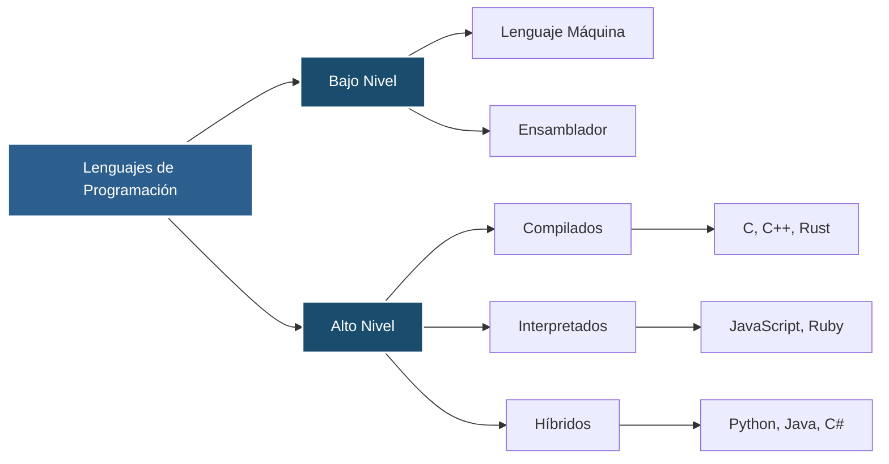

</div>

**Por tipado:**

<div style="background-color: black; border-radius: 10px; padding: 20px; margin: 20px 0;">

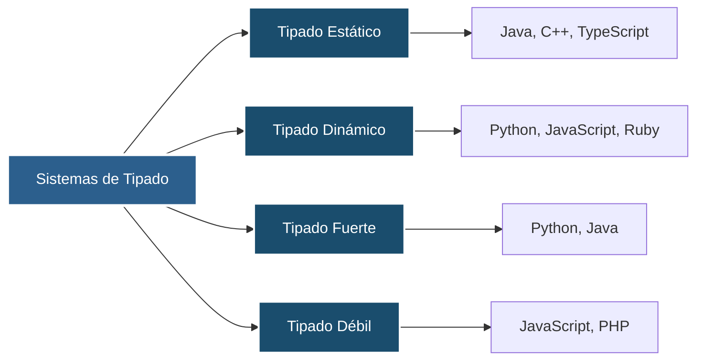

</div>

### Dominios de Aplicación

Los lenguajes de programación se especializan en diferentes dominios:

<div style="background-color: black; border-radius: 10px; padding: 20px; margin: 20px 0;">

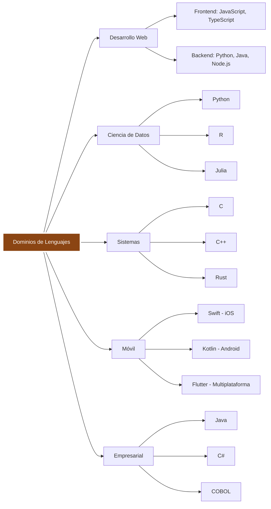

</div>

### Paradigmas de Programación

<div style="background-color: black; border-radius: 10px; padding: 20px; margin: 20px 0;">

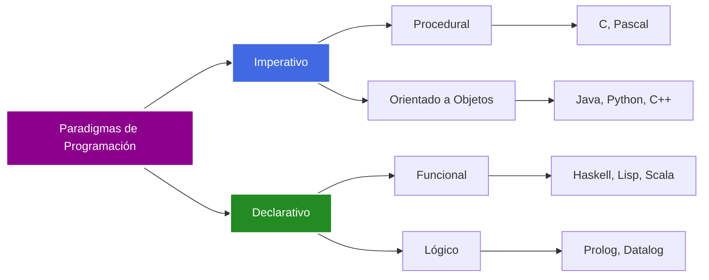

</div>

**Características de cada paradigma:**

- **Imperativo**: Define cómo se ejecuta el programa paso a paso
- **Declarativo**: Define qué se quiere lograr, no cómo
- **Orientado a Objetos**: Organiza código en objetos con datos y comportamiento
- **Funcional**: Trata la computación como evaluación de funciones matemáticas

---

## Introducción e Instalación a Python

### ¿Qué es Python?

Python es un lenguaje de programación de alto nivel, interpretado, de propósito
general y con tipado dinámico. Creado por Guido van Rossum en 1991.

<div style="background-color: black; border-radius: 10px; padding: 20px; margin: 20px 0;">

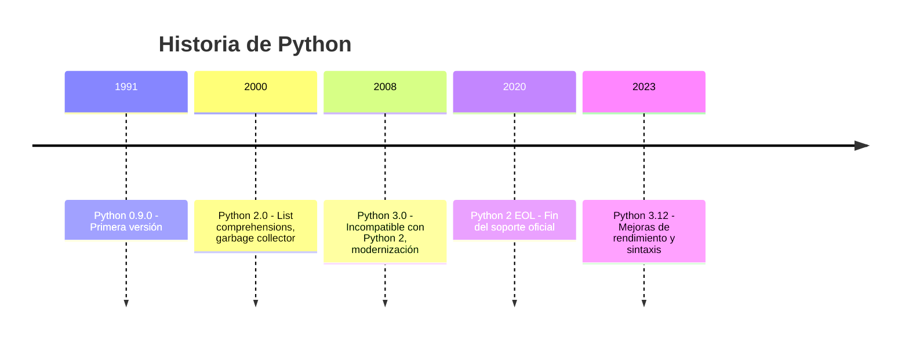

</div>

### Características Principales

<div style="background-color: black; border-radius: 10px; padding: 20px; margin: 20px 0;">

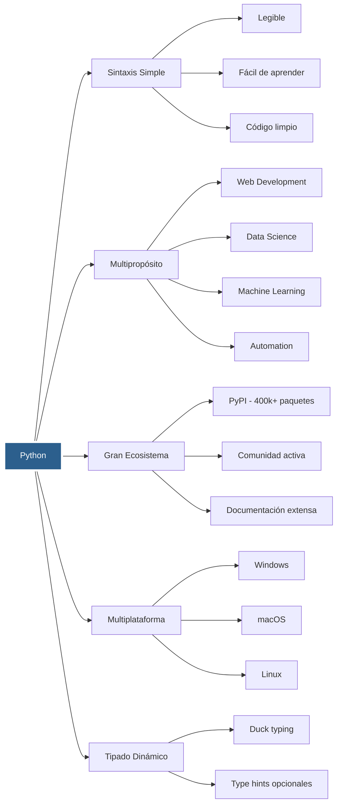

</div>

### Proceso de Instalación

<div style="background-color: black; border-radius: 10px; padding: 20px; margin: 20px 0;">

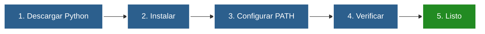

</div>

**Pasos detallados por sistema operativo:**

- **Windows**: Descargar desde python.org → Ejecutar instalador → Marcar "Add to PATH"
- **macOS**: `brew install python3` o descargar desde python.org
- **Linux**: `sudo apt install python3` o `sudo yum install python3`

**Verificación:**

```bash
python --version
pip --version
```

### Gestión de Entornos Virtuales

<div style="background-color: black; border-radius: 10px; padding: 20px; margin: 20px 0;">

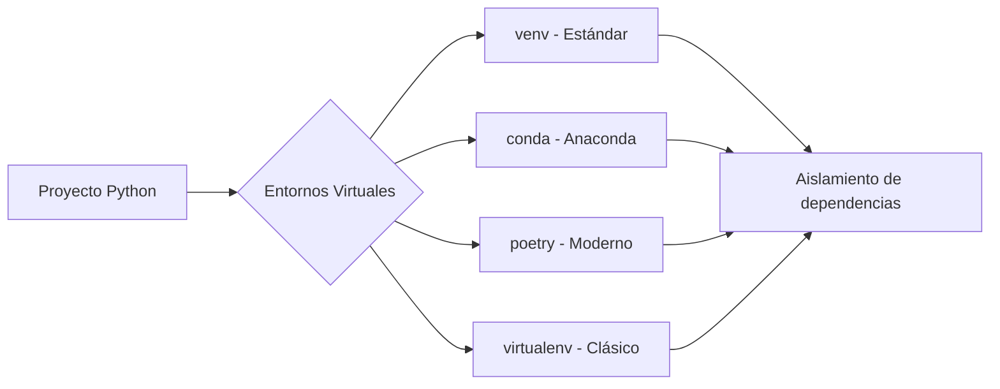

</div>

---

## Formas de Ejecutar Código Python

### Modalidades de Ejecución

<div style="background-color: black; border-radius: 10px; padding: 20px; margin: 20px 0;">

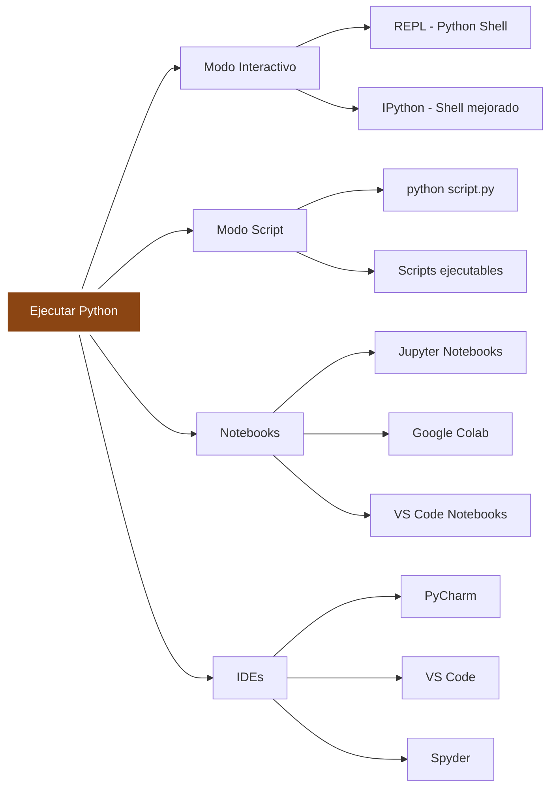

</div>

### Comparación de Métodos

<div style="background-color: black; border-radius: 10px; padding: 20px; margin: 20px 0;">

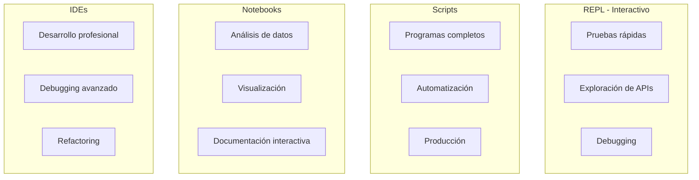

</div>

### Flujo de Ejecución

<div style="background-color: black; border-radius: 10px; padding: 20px; margin: 20px 0;">

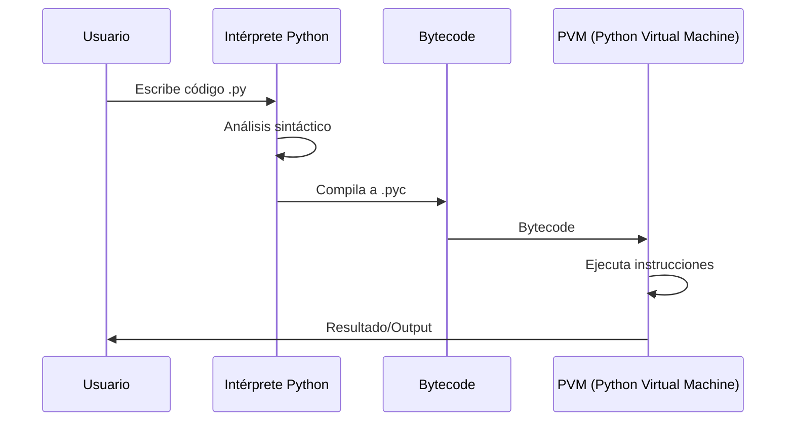

</div>

### Comandos Básicos

**REPL/Shell:**

```bash
# Iniciar Python shell
python
>>> print("Hola Mundo")
>>> exit()

# IPython (más features)
ipython
```

**Ejecutar Scripts:**

```bash
# Ejecución básica
python mi_script.py

# Con argumentos
python mi_script.py arg1 arg2

# Script ejecutable (Unix/Linux)
chmod +x mi_script.py
./mi_script.py
```

**Jupyter:**

```bash
# Instalar
pip install jupyter

# Iniciar servidor
jupyter notebook

# O JupyterLab
jupyter lab
```

---

## Sintaxis y Estructura Básica

### Elementos Fundamentales

<div style="background-color: black; border-radius: 10px; padding: 20px; margin: 20px 0;">

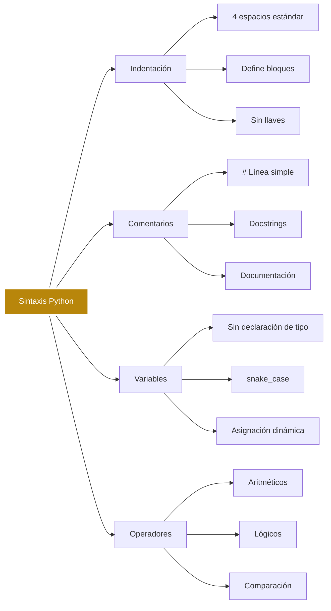

</div>

### Estructura de un Programa Python

<div style="background-color: black; border-radius: 10px; padding: 20px; margin: 20px 0;">

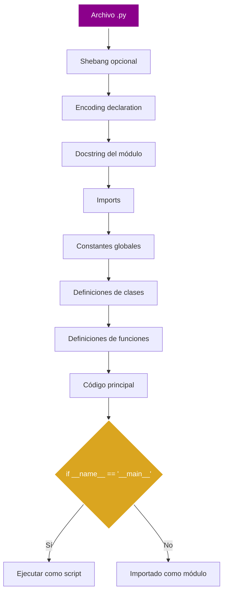

</div>

### Tipos de Datos Básicos

<div style="background-color: black; border-radius: 10px; padding: 20px; margin: 20px 0;">

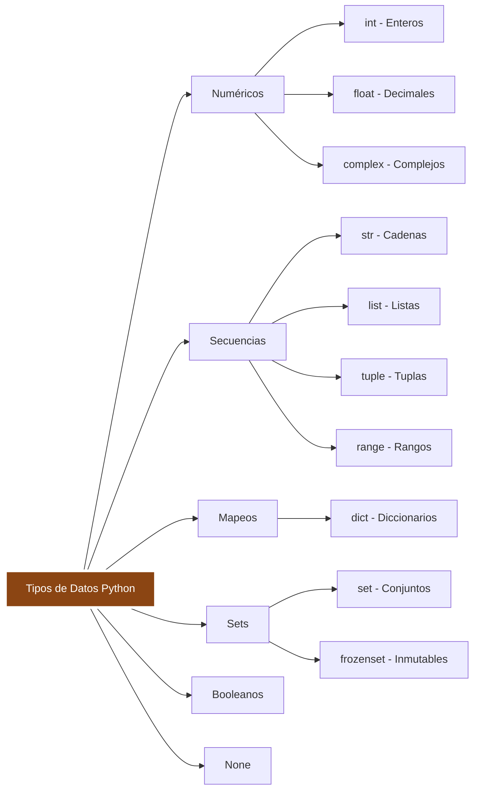

</div>

### Estructuras de Control

<div style="background-color: black; border-radius: 10px; padding: 20px; margin: 20px 0;">

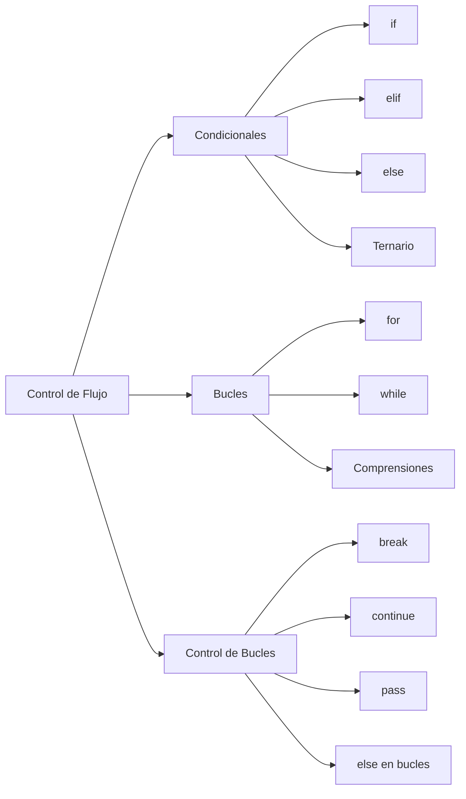

</div>

### Ejemplo de Sintaxis Completa

```python
#!/usr/bin/env python3
# -*- coding: utf-8 -*-
"""
Módulo de ejemplo mostrando sintaxis básica de Python.
"""

# Imports
from typing import List, Optional
import math

# Constante global
PI = 3.14159

class Calculadora:
    """Clase ejemplo con operaciones básicas."""

    def __init__(self, nombre: str):
        self.nombre = nombre
        self.historial: List[float] = []

    def sumar(self, a: float, b: float) -> float:
        """Suma dos números."""
        resultado = a + b
        self.historial.append(resultado)
        return resultado

    def area_circulo(self, radio: float) -> float:
        """Calcula el área de un círculo."""
        return PI * radio ** 2

def main():
    """Función principal."""
    # Crear instancia
    calc = Calculadora("MiCalc")

    # Operaciones
    suma = calc.sumar(5, 3)
    area = calc.area_circulo(10)

    # Condicional
    if suma > 5:
        print(f"La suma {suma} es mayor que 5")

    # Bucle for
    for i in range(3):
        print(f"Iteración {i}")

    # List comprehension
    cuadrados = [x**2 for x in range(5)]
    print(cuadrados)

if __name__ == "__main__":
    main()
```

### Convenciones de Estilo (PEP 8)

<div style="background-color: black; border-radius: 10px; padding: 20px; margin: 20px 0;">

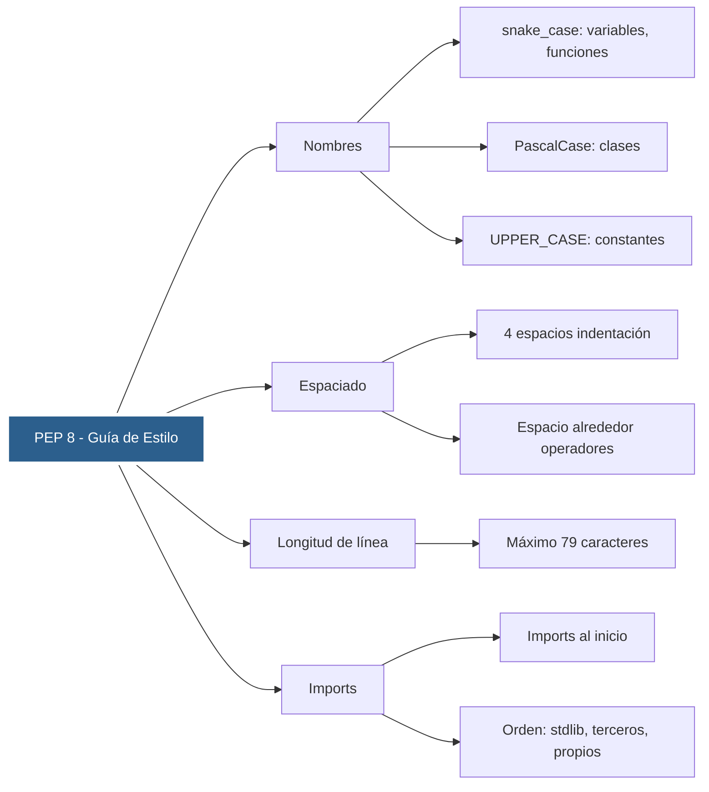

</div>

---

<style>
  .background-images {
    pointer-events: none;
  }
  .background-images* {
    pointer-events: auto;
  }
</style>

<div
  class="background-images"
  style="
    position: fixed;
    top:0;
    display: flex;
    justify-content: center;
    align-items: center;
    height: 100vh;
    opacity: 0.1;
    z-index: 0;
  "
>


</div>
